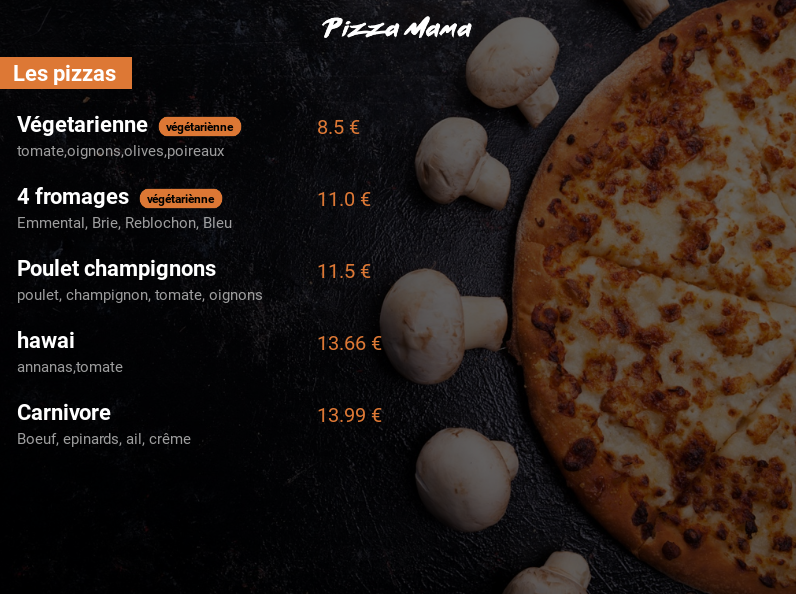

# Pizza Mama

Pizza Mama is a web application developed with the Django framework. It allows managing pizza recipes through an API connected to a SQL database. The application is also dynamically linked to a website hosted on [PythonAnywhere](https://thesirix.pythonanywhere.com/), displaying the same data as the API.

## Features

- Display of pizza recipes from the SQL database.
- Dynamic connection with the website to display the same data.
- Possibility for the administrator to:
  - Edit pizza prices.
  - Update pizza availability.
  - Modify the list of pizza ingredients.

## Application Structure

The application is structured as follows:

1. **API**: Allows retrieving pizza recipe data from the SQL database.
2. **Website**: Hosted on [PythonAnywhere](https://thesirix.pythonanywhere.com/), it displays the same data as the API dynamically.
3. **Administrator Interface**: Allows the administrator to manage available pizzas, their prices, and their ingredients.

## Technologies Used

- Django: Web framework used to develop the application.
- SQL Database: Storage of pizza recipes.
- HTML/CSS: Used to develop the web interface.
- PythonAnywhere: Hosting platform used for website deployment.

## Installation

1. Clone the Git repository.
2. Install Python dependencies.
3. Launch the application.

## Administrator Guide

1. Modify pizza prices.
2. Update pizza availability.
3. Modify the list of pizza ingredients.

