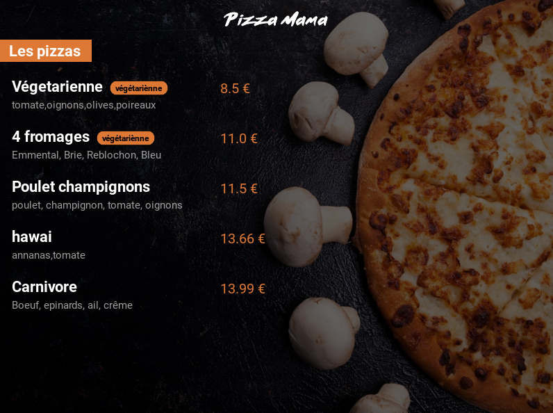

# Pizza Mama

Pizza Mama est une application web développée avec le framework Django. Elle permet de gérer des recettes de pizzas à travers une API connectée à une base de données SQL. L'application est également reliée dynamiquement à un site web hébergé sur [PythonAnywhere](https://thesirix.pythonanywhere.com/), affichant les mêmes données que l'API.

## Fonctionnalités

- Affichage des recettes de pizzas depuis la base de données SQL.
- Connexion dynamique avec le site web pour afficher les mêmes données.
- Possibilité pour l'administrateur de :
  - Éditer les prix des pizzas.
  - Mettre à jour la disponibilité des pizzas.
  - Modifier la liste des ingrédients des pizzas.

## Structure de l'Application

L'application est structurée de la manière suivante :

1. **API** : Permet de récupérer les données des recettes de pizzas depuis la base de données SQL.
2. **Site Web** : Hébergé sur [PythonAnywhere](https://thesirix.pythonanywhere.com/), il affiche les mêmes données que l'API de façon dynamique.
3. **Interface Administrateur** : Permet à l'administrateur de gérer les pizzas disponibles, leurs prix et leurs ingrédients.

## Technologies Utilisées

- Django : Framework web utilisé pour développer l'application.
- Base de données SQL : Stockage des recettes de pizzas.
- HTML/CSS : Utilisés pour développer l'interface web.
- PythonAnywhere : Plateforme d'hébergement utilisée pour le déploiement du site web.

## Installation

1. Cloner le dépôt Git.
2. Installer les dépendances Python.
3. Lancer l'application.

## Guide de l'Administrateur

1. Modifier les prix des pizzas.
2. Mettre à jour la disponibilité des pizzas.
3. Modifier la liste des ingrédients des pizzas.

